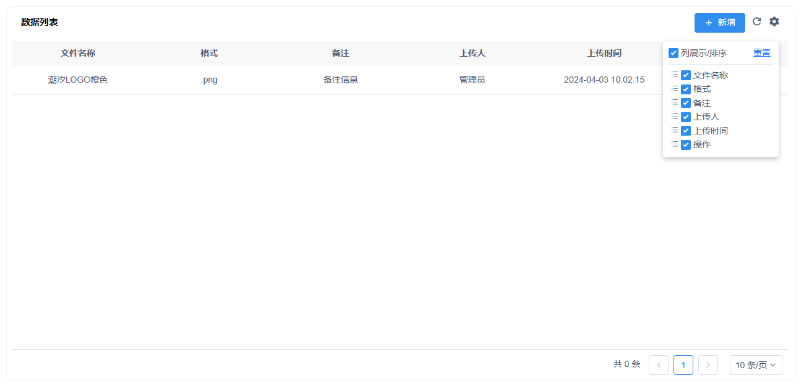

# drag_Table
iview Table，vuedraggable
给iview的Table二次封装，添加一个表格列拖拽的功能，右上角自定义列的显示和顺序，Table的功能没有完整搬运，其他的可以自行添加。直接文件中引用组件就可以。

效果如下：
右上角点击齿轮设置表格列的显示隐藏可拖拽自定义列的顺序，再次点击齿轮弹窗消失。
左边刷新按钮触发refreash事件。
再左边是一个btnSlot插槽的位置，放按钮或其他内容。
